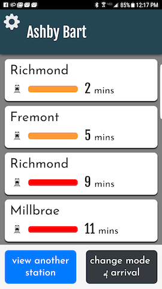
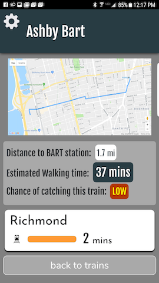

# Bart Now

 

[Link to app](https://yiyi098.github.io/BART-Now/)

### Overview
We have created a functional application for Bay Area Rapid Transit (BART) users. The basic notion for this mobile application is to locate the closest BART Station using the end-user’s geolocation through their mobile device interacting with Google API & Bart API. The application will then populate the user interface with relevant BART data on upcoming trains and their scheduled arrival/departure times. 

For example, if the end-user is at the UC Berkeley extension building and would like to head to the San Francisco campus he/she would open the app and it would provide them with the list of trains arriving soon at Downtown Berkeley Station along with their scheduled arrival times. In this case the user could select the train bound for SF/Millbrae arriving in 10 mins. Upon selecting the train the navigation page would load and provide the end-user with his/her precise geolocation, distance from the closest Bart Station, and estimated time it will take to get there, either by a preselected mode of arrival, or by the default, "walking". Interacting with the Google API app will route an itinerary for the end with an ETA to the nearest station.

The end user also has some alternative choices with the “view more trains” button if they wanted to modify their time of departure or destination. The “view another station” button will enable the user to change their departure location in this particular case lets say Downtown Berkeley to North Berkeley if need be. 

Additionally, the "change mode" button will interact with the Google Maps API should the end user decide to change the mode of transportation to the BART. There is a drop down menu that populates and gives the user option of choosing between walking, bicycling or driving to arrive at the chosen BART Station. 

Furthermore, there is an "Options Cog," in the top left for end-users to set and store their preferred settings for mode of transport, station, and train.

### Technologies
* JavaScript / HTML / CSS / Bootstrap
* Tippy.js (https://atomiks.github.io/tippyjs/)
* Firebase Database
* BART API
* Google Maps API

### Credits
* Abdel Rahman
* Ehler Orngard
* Nick Wactor
* Denis Wu
